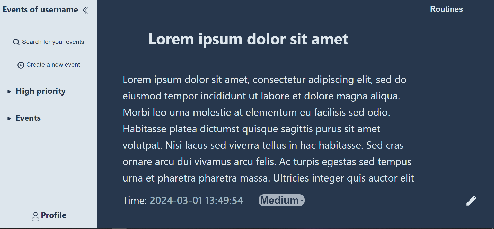
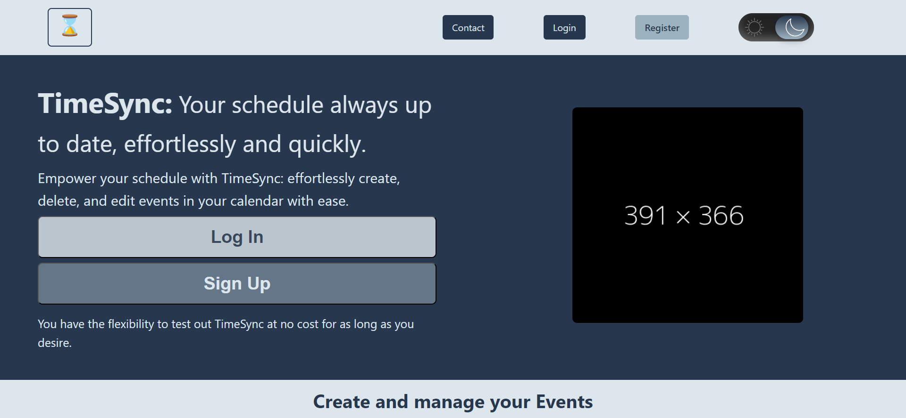
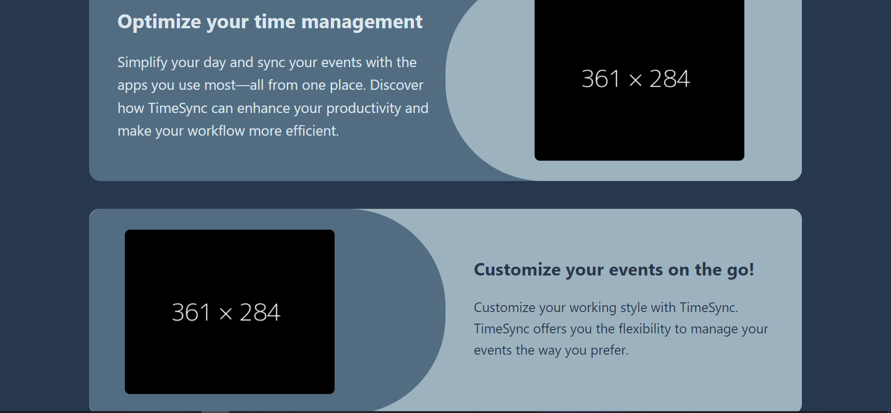
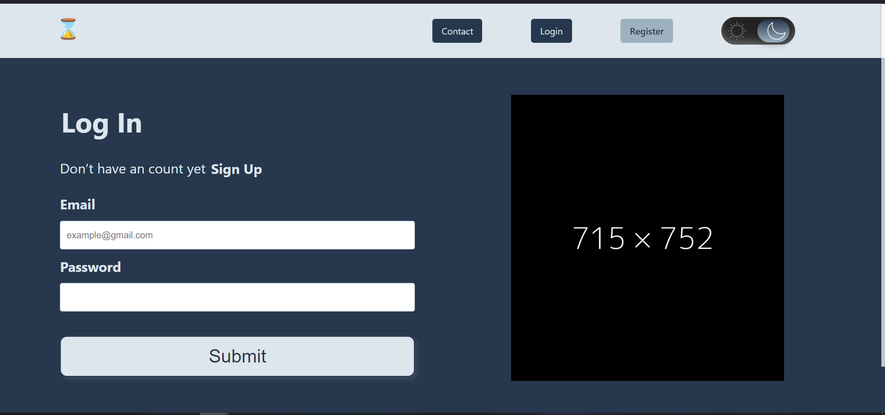

<h1 align="center">
    Documentación de TimeSync
</h1>

# Indice de contenido.

# Introducción

## Expectativas/objetivos y antecedentes
La idea original era crear un gestor de eventos que el usuario pudiera crear y editar para gestionar su tiempo. Ademas de comprender más como funciona Vue y como relacionarlo con Laravel. 

Queria tambien implementar categorias y rutinas a la aplicacion pero mi idea era expandir este proyeto en el TFG e implementar esas funcionalidades ahi.

Antes de esta aplicacion hice una sobre una libreria con el stack MERN, asi que conocia como relacionar el frontend con el backend solo faltandome como hacerlo con la tecnologia usada en el proyecto.

# Descripción: Descripción del resultado obtenido: funcionalidades,organización, etc.
La aplicacion creada tiene la funcionalidad principal de crear, editar y ver eventos. Los eventos constan de un titulo, descripcion, una fecha(originalmente iban a ser 2 fechas para medir el tiempo de inicio y fin, pero al final solamente deje la fecha de inicio, aunque la fecha de fin se muestra en el perfil del usuario) y la prioridad del evento.

La aplicacion consta tambien de una landing page que explica brevemente las funcionalidades de la aplicacion, una pagina de contacto, login, signup y el perfil del usuario donde se meustran los eventos que tiene creados 

La funcionalidad principal de crear eventos para un usuario y que estos eventos se puedan editar por el usuario esta implementada, estos eventos son unicos por usuario ya que ellos mismos los crean. 

Tambien se puede buscar entre los eventos creados, esto es algo que me hubiera gustado mejorar como implementar busqueda por prioridad y fecha pero no tuve tiempo 

El usuario tambien puede ver los eventos que tiene creados 

# Instalación y preparación: 

   Para la instalacion siga los pasos del [README](./README.md)

# Guía de estilos y prototipado. Se incluye tanto la guía de estilos como los wireframe o mockups de la aplicación.

   Pagina principal
   

   Primera parte de la Landing page 
   

   Segunda parte de la landing Page 
   

   Log in (La pagina de contacto y Sign Up son practicamente iguales)
   

# Diseño: Descripción y diagramas de diseño: entidad relación, casos de uso, diagramas de flujo...etc.

    Modelo entidad relacion 
   

   Para el diseño de la aplicacion se ha usado figma, y para realizar el estilo en html he usado css.

# Desarrollo: Secuencia de desarrollo, dificultades encontradas y decisiones afrontadas. Descripción de las herramientas de control de versiones y revisión del código utilizadas.

La secuencia de desarrollo fue algo erratica, ya que devido a las entregas de frontend y backend teniamos que estar haciendo uno y cambiando al otro, lo que a veces puede ser desorientativo 

Algunos de los problemas encontrados a sido la generalizacion del codigo al tener muchas veces un mismo componente para arreglar un fallo es complicado solucionar el fallo en todos los lados 

Y el resto de fallos la mayoria ha sido de diseño, ya que se me descuadraban las secciones y fue a lo que más tiempo le he dedicado, junto con la creacion del backend 

# Despliegue: Tecnología de despliegue y descripción del proceso.

Para el despliegue se ha usado un docker docker compose para desplegar laravel y la base de datos.

Para desplegar el frontend esta la guia al final del [README](./README.md)

Aqui esta el enlace a Netlify
# Manual: Manual de uso de la aplicación.

Enlace al [video](https://drive.google.com/file/d/1rLIfENcekfJWhruZmL3X3KzbUWlJBE2M/view?usp=sharing)

# Conclusiones: Comparación del resultado con la idea inicial y mejoras futuras.
La aplicacion esta bastante incompleta comparado con mi idea inical, pero he consolidado la manera de gestionar los eventos y estados que vimos en React asi como los estados globales, ya que antes no entendia muy bien como usarlos pero con este proyecto he cementado esos conocimientos

Las posibles mejoras seria añadir las categorias y rutinas, ya que la app actualmente esta bastante vacia contando unicamente de la pagina principal de gestion de eventos como contenido principal, el resto de paginas son suplementarias a esta por lo que no aportan tanto como esta
