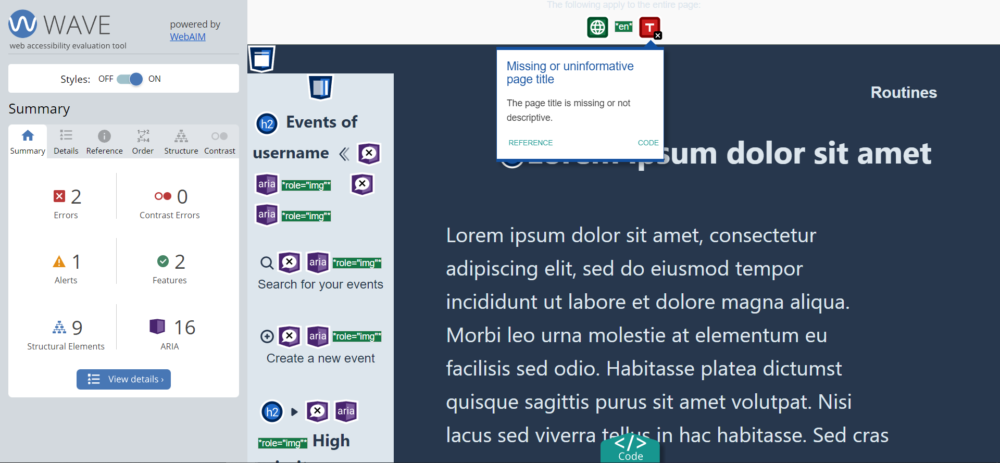
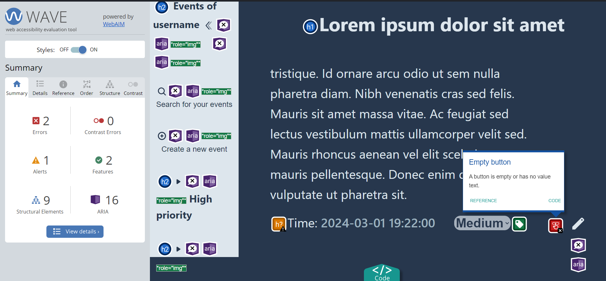
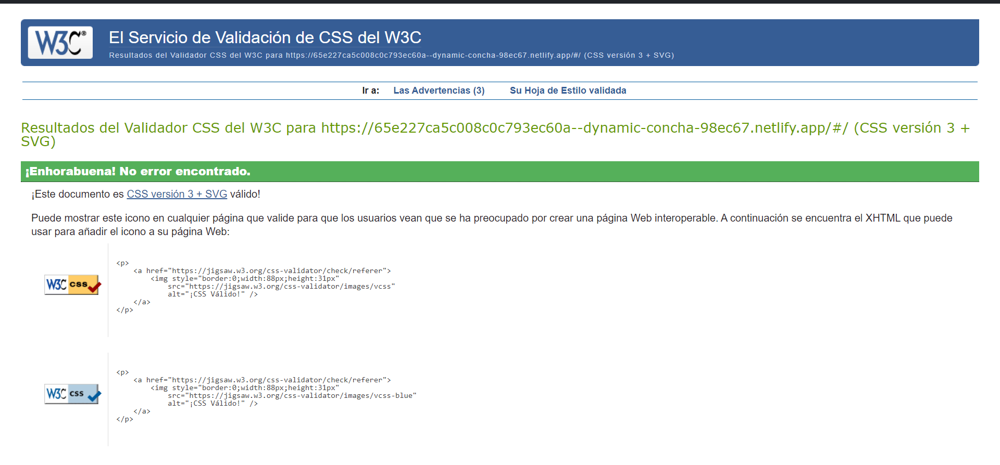
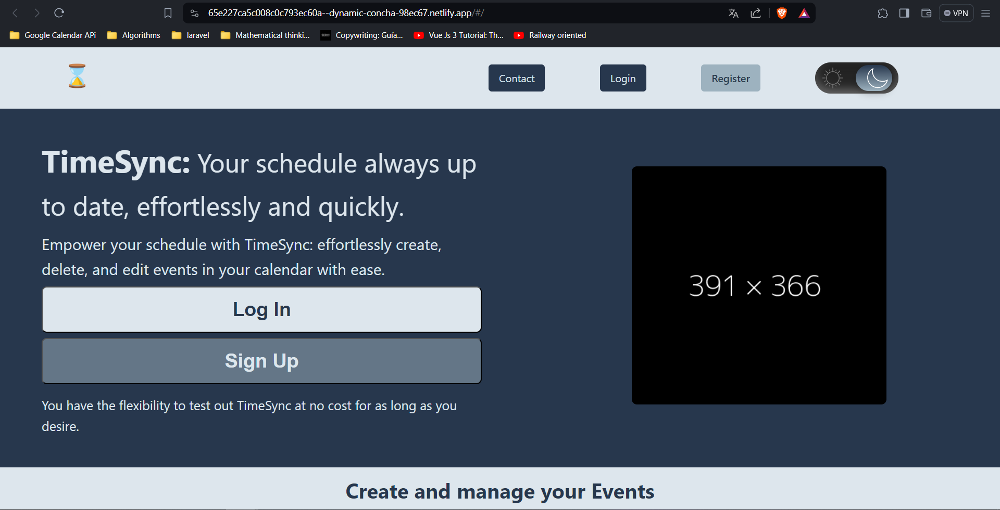

El error aqui es por no tener un titulo, aunque la pagina tiene el titulo que seria el titulo del evento

El otro fallo que aparece en la pagina es por el botton de editar que al contener solamente el icono

Para el validador de css de W3C este es el resultado

